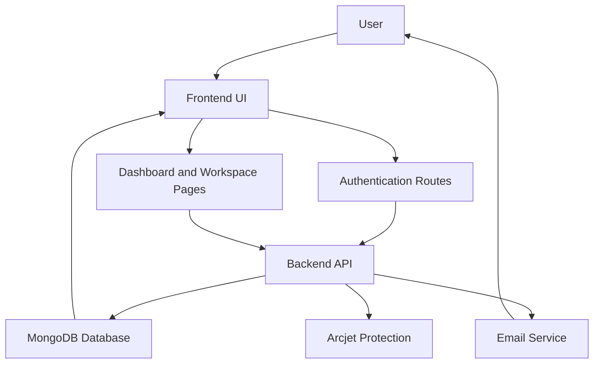

# OrbitFlow

OrbitFlow is a full-stack team collaboration platform built to help modern teams manage their work in a single place. It combines workspace-based organization, project tracking, and task execution into a streamlined experience for product, engineering, and operations teams.

The application is split into two main services:

- a Node.js and Express backend for business logic, authentication, database access, and API endpoints
- a React Router 7 frontend for the user interface, dashboard, and interactive workflows

## What OrbitFlow does

OrbitFlow allows users to:

- create and join workspaces for team-based collaboration
- manage projects inside each workspace
- create and track tasks with statuses, priorities, assignees, subtasks, comments, and watchers
- monitor team activity and recent work from a central dashboard
- onboard new members through workspace invites
- authenticate securely with email-based verification and password recovery

## Core features

### 1. Authentication and account management

OrbitFlow includes a complete authentication flow for:

- user registration
- login and session handling
- email verification
- password reset and recovery
- profile-related user operations

### 2. Workspace management

Users can create workspaces and organize work around shared team goals. Workspaces act as the top-level container for collaboration, projects, and team members.

### 3. Project management

Each workspace can contain multiple projects, making it easy to group related work and track progress by initiative.

### 4. Task management

Tasks are the heart of the platform. Each task can include:

- title and description
- status and priority
- assignees and watchers
- subtasks
- comments
- activity history

This makes OrbitFlow suitable for agile-style workflow tracking and internal team execution.

### 5. Dashboard and insights

The dashboard provides an overview of:

- recent projects
- upcoming tasks
- task and workspace statistics
- activity-based visibility into project progress

## Technology stack

### Backend

- Node.js
- Express.js
- MongoDB with Mongoose
- JWT-based authentication
- bcrypt for password hashing
- Zod for request validation
- Nodemailer for email delivery
- Arcjet for request protection

### Frontend

- React 19
- React Router 7
- TypeScript
- TanStack React Query
- Tailwind CSS
- Radix UI and MUI-based UI primitives
- Recharts for analytics visuals

### DevOps and deployment

- Docker Compose for local containerized runs
- Kubernetes manifests under the k8s folder for deployment readiness

## Project structure

```text
OrbitFlow/
├── backend/                  # Express API and MongoDB integration
│   ├── src/
│   │   ├── controllers/      # Auth, user, workspace, project, task logic
│   │   ├── models/           # MongoDB schemas
│   │   ├── routes/           # API route definitions
│   │   ├── middleware/       # Auth and request handling
│   │   └── utils/            # Shared helpers and email utilities
│   └── package.json
├── frontend/                 # React Router application
│   ├── app/
│   │   ├── components/       # Reusable UI and feature components
│   │   ├── hooks/            # Data fetching and state hooks
│   │   ├── routes/           # Pages and route modules
│   │   └── provider/         # Auth and query providers
│   └── package.json
├── docker-compose.yml        # Local multi-container setup
├── k8s/                      # Kubernetes deployment manifests
└── README.md
```

## Prerequisites

Before running OrbitFlow locally, make sure you have:

- Node.js 18 or newer
- npm
- MongoDB running locally or a MongoDB Atlas connection
- Docker (optional, for container-based setup)

## Environment configuration

### Backend

Create a .env file inside the backend folder:

```bash
cd backend
cat > .env <<'EOF'
PORT=8000
MONGODB_URI=mongodb://127.0.0.1:27017
JWT_SECRET=your-jwt-secret
CORS_ORIGIN=http://localhost:5173
FRONTEND_URL=http://localhost:5173
EMAIL=your-email@example.com
EMAIL_PASS=your-email-password-or-app-password
ARCJET_KEY=your-arcjet-key
EOF
```

### Frontend

Create a .env file inside the frontend folder:

```bash
cd frontend
cat > .env <<'EOF'
VITE_API_URL=/api-v1
EOF
```

## Running the project locally

### Start the backend

```bash
cd backend
npm install
npm run dev
```

The backend will run on port 8000 and expose the API under /api-v1.

### Start the frontend

```bash
cd frontend
npm install
npm run dev
```

Open the local frontend URL shown in the terminal, usually http://localhost:5173.

## Running with Docker Compose

To run both services together:

```bash
docker compose up --build -d
```

Useful commands:

```bash
docker compose logs -f
docker compose down
```

## API overview

The backend exposes REST endpoints through the /api-v1 prefix for:

- authentication and account operations
- workspace creation and management
- project management
- task management and updates
- user profile and account-related actions

## Application flow

The application flow can be summarized as follows:



## Notes

- The main backend entry point is backend/src/index.js.
- The main frontend entry point is frontend/app/root.tsx.
- The project is designed to be extended for real-world team collaboration, reporting, and workflow automation.

## CI/CD (GitOps) Overview

The repository includes a GitHub Actions workflow (`.github/workflows/ci.yml`) that builds, scans, and publishes container images, updates Kubernetes manifests, and drives a GitOps-based deployment via ArgoCD.

```text
            Developer
               │
           git push main
               │
               ▼
        GitHub Repository (Source Code)
               │
               ▼
       GitHub Actions (CI)
               │
    ┌───────────────────────────────┐
    │ Checkout                      │
    │ Setup Node                    │
    │ npm install                   │
    │ Docker Build                  │
    │ Trivy Scan                    │
    │ Push Docker Image             │
    │ Update K8s Manifest (yq)      │
    │ Commit & Push                 │
    └───────────────────────────────┘
               │
               ▼
        GitHub Repository (GitOps)
               │
               ▼
           ArgoCD watches Git
               │
               ▼
        Detect Manifest Change
               │
               ▼
       Sync Kind Kubernetes Cluster
               │
               ▼
       Rolling Update Deployment
               │
               ▼
           New Pods Running
```

How it works:

- Push to `main` triggers the CI workflow at `.github/workflows/ci.yml`.
- The workflow builds Docker images, runs a Trivy vulnerability scan, and pushes the image to the configured container registry.
- The workflow updates the Kubernetes manifests (using `yq`), commits those changes back to the repository, and pushes to the GitOps branch/path.
- ArgoCD monitors the Git repository, detects manifest changes, and performs a sync to the Kubernetes cluster (Kind in our setup), resulting in a rolling update of deployments.

Quick references:

- Workflow file: [.github/workflows/ci.yml](.github/workflows/ci.yml)
- Kubernetes manifests: [k8s/](k8s/)
- To trigger manually: push to the `main` branch or run the workflow from the Actions tab.

If you'd like, I can add a workflow badge (requires repository owner/name) and commit the README changes to a branch for review.
