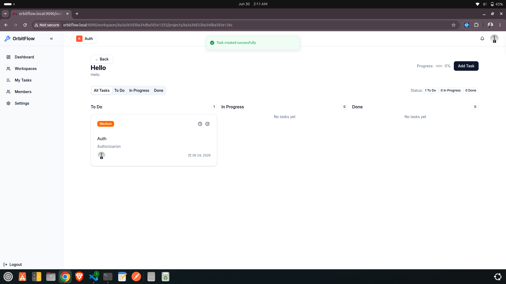

# OrbitFlow

OrbitFlow is a full-stack team collaboration platform for creating workspaces, managing projects, organizing tasks, and tracking activity across a product team. The application is split into a Node.js/Express backend and a React Router 7 frontend.

## Highlights

- Authentication flows for registration, login, email verification, and password reset
- Workspace and project management for team-based collaboration
- Task management with title, description, status, priority, assignees, subtasks, comments, and watchers
- Activity tracking and invite-based workspace onboarding
- Modern UI built with React, TypeScript, Tailwind CSS, and Radix UI primitives

## Tech Stack

### Backend

- Node.js
- Express
- MongoDB with Mongoose
- JWT authentication
- bcrypt for password hashing
- Zod for request validation
- Nodemailer for email delivery
- Arcjet for request protection

### Frontend

- React 19
- React Router 7
- TypeScript
- TanStack React Query
- Tailwind CSS
- Radix UI + MUI components
- Recharts for analytics visuals

## Project Structure

```text
OrbitFlow/
├─ backend/             # Express API service
│  ├─ src/              # Controllers, models, routes, middleware, utils
│  └─ package.json
├─ frontend/            # React Router frontend
│  ├─ app/              # Routes, layouts, providers, hooks, components
│  └─ package.json
├─ docker-compose.yml   # Local container orchestration
├─ k8s/                 # Kubernetes manifests
└─ README.md
```

## Prerequisites

- Node.js 18+ recommended
- npm
- A MongoDB instance or MongoDB Atlas connection
- Docker (optional, for container-based runs)

## Backend Setup

1. Change into the backend folder:

```bash
cd backend
npm install
```

2. Create a backend environment file:

```bash
cat > .env <<'EOF'
PORT=8000
MONGODB_URI=mongodb://127.0.0.1:27017
JWT_SECRET=your-jwt-secret
CORS_ORIGIN=http://localhost:5173
FRONTEND_URL=http://localhost:5173
EMAIL=your-email@example.com
EMAIL_PASS=your-email-password-or-app-password
ARCJET_KEY=your-arcjet-key
EOF
```

3. Start the backend:

```bash
npm run dev
```

The backend runs on port 8000 and exposes the API under `/api-v1`.

## Frontend Setup

1. Change into the frontend folder:

```bash
cd frontend
npm install
```

2. Create a frontend environment file:

```bash
cat > .env <<'EOF'
VITE_API_URL=/api-v1
EOF
```

3. Start the frontend:

```bash
npm run dev
```

Open the local Vite URL shown in the terminal, usually `http://localhost:5173`.

## Running Locally

Run the backend and frontend in separate terminals:

```bash
# Terminal 1
cd backend
npm run dev
```

```bash
# Terminal 2
cd frontend
npm run dev
```

## Production Build

### Backend

```bash
cd backend
npm run start
```

### Frontend

```bash
cd frontend
npm run build
npm run start
```

## Docker Compose

This repository includes Dockerfiles for both services and a compose configuration for running everything together.

```bash
docker compose up --build -d
```

Useful commands:

```bash
docker compose logs -f
docker compose down
```

## API Overview

The backend provides REST endpoints for:

- Authentication: register, login, verify email, reset password
- Users: profile management and password changes
- Workspaces: create workspaces and manage members/invites
- Projects: create and view projects inside workspaces
- Tasks: create, update, comment on, watch, and complete tasks

## Notes

- The backend entry point is [backend/src/index.js](backend/src/index.js).
- The frontend application entry is [frontend/app/root.tsx](frontend/app/root.tsx).
- Each service manages its own dependencies and scripts independently.


## Dashboard


## Workspace
